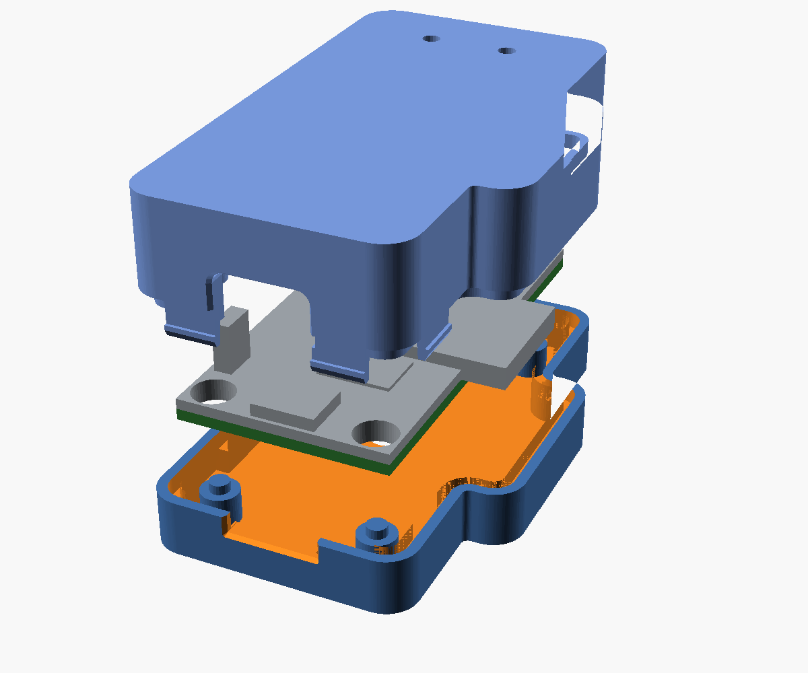
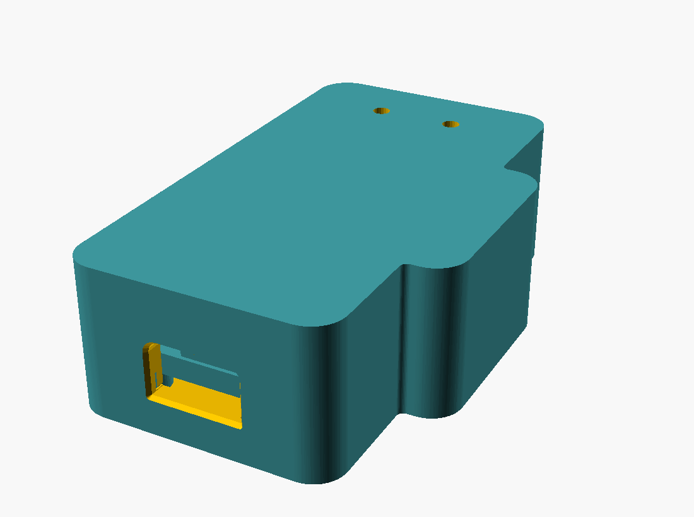
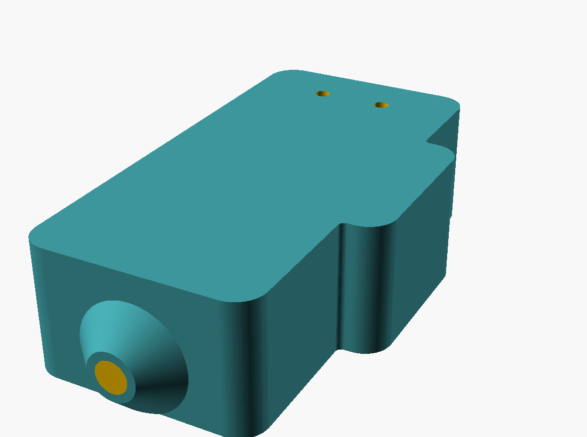
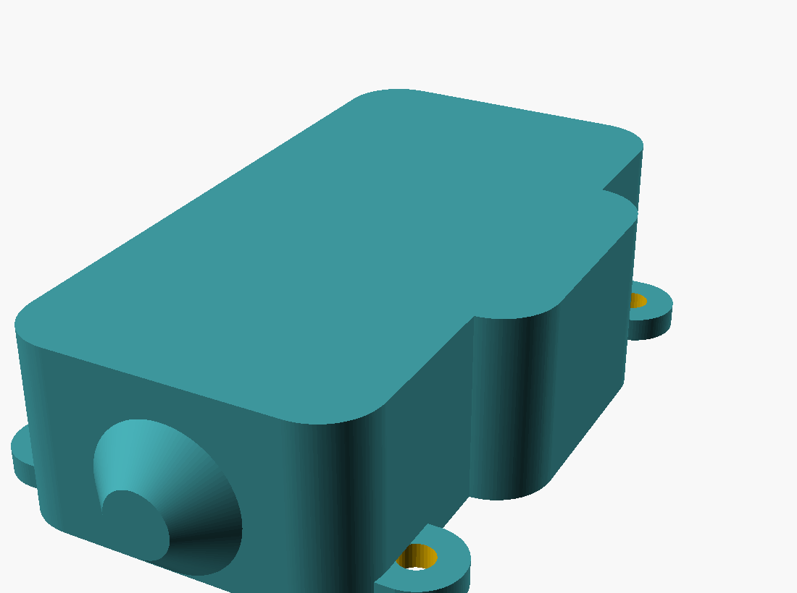

# SmartishMiniLED enclosure

A parametric, 3D printable case for the SmartishMiniLED board. Two parts that
clip together, open cable exits with cable-tie saddles, and **no support
material anywhere** in either half.

Everything is generated from one OpenSCAD file,
[`smartishminiled_case.scad`](smartishminiled_case.scad).



*Exploded view of the `usb` case, drawn with the optional button fitted.*

## Variants

| | `usb` | `hardwired` | `outdoor` |
|---|---|---|---|
| |  |  |  |
| Power in | USB-C plug into J1 | cable soldered to the J4 pads | cable soldered to the J4 pads |
| Cable entries | LED strip only | LED strip + power | LED strip + power, sealed |
| Held together by | 4 snap fingers | 4 snap fingers | 4 snap fingers + 4 M3 screws |
| Sealing | none | none | 2 mm silicone cord gasket, blind LED windows, blind IR window and membrane button if those are enabled |
| Button (optional) | printed plunger | printed plunger | moulded-in flexing membrane |
| Mounting lugs | optional, on by default | optional, on by default | optional, on by default |
| Body size (mm) | 44.6 × 84.8 × 21.7 | 44.6 × 106.0 × 21.7 | 49.4 × 110.8 × 22.7 |

Lengths include the cable-tie saddles; widths include the antenna lobe but not
the optional mounting lugs. Add 1.5 mm to the width with `ir_window=true`.

## Optional features

SW2 and U5 are usually left off the board - they are both in the `--ignore` list
the fabrication workflow hands to JLCPCB - so neither feature is cut by default
and the case comes out with a solid floor and a plain left wall:

| | default | turn on with | effect |
|---|---|---|---|
| IR window | off | `-D ir_window=true` | 6 × 6 mm window in the left wall, and 1.5 mm more side clearance, which the MINICAST package needs where it hangs over the board edge. **Set this if U5 is fitted**, window or not. |
| Button | off | `-D button=true` | way through the floor to SW2: a captive printed plunger, or on `outdoor` a moulded-in membrane that keeps the case sealed. |

The images above are the default build.

## What the board dictates

The shape is not arbitrary - it is driven by what is actually on the PCB
(all figures measured out of `SmartishMiniLED.kicad_pcb`, board origin at the
corner nearest the IR receiver):

| Feature | Where | What the case does |
|---|---|---|
| Board outline | 30 × 60 × 1.6 mm | 1.2 mm side clearance for the snap fingers |
| M3 mounting holes | 3.5 mm in from each corner, 23 × 53 mm pitch | stand-offs below, bosses above, optional M3 screws |
| **U1 ESP32-WROOM-32D** | the module is mounted so the antenna **overhangs the right hand board edge by 6.2 mm** (y 21.8 - 39.8) | the case grows a lobe on that side with ~1.2 mm of air around the antenna tip |
| **U5 IR receiver** | overhangs the left edge by 1.2 mm and looks sideways out of it | 6 × 6 mm window in the left wall, on the parting line - *optional, off by default* |
| J1 USB-C | on the front edge, opening 3.3 mm above the board | 13 × 7.8 mm opening, big enough for the moulded boot of a plug, with a lead-in flare |
| J4 power pads | **underside**, right behind the USB connector | hardwired variants get an 8 mm wiring chamber at that end so the cable can curve down and back under the board |
| P1/P2 LED strip pads, J3 terminal block | far end of the board | 4 mm wiring chamber, cable snout in line with the pads |
| C6 (10 mm can), J3 (10.2 mm) | tallest parts | 11.6 mm of headroom under the lid |
| SW2 | underside, middle of the board | button in the floor - *optional, off by default* |
| D2/D3 status LEDs | far end, top side | 2.6 mm windows in the lid roof |

## Why it needs no supports

* The parting line sits **exactly on the top face of the PCB**. Every opening in
  a wall (USB, IR window, both cable entries) straddles that line, so in each
  half it is a notch that is open at the joint - there is nothing to bridge.
* The base has a completely flat outside face: no feet, no protruding bosses.
  The screw heads go into 90° countersinks, which are 45° cones.
* The lid prints roof-down; its bosses, lip and snap fingers all point up.
* The outdoor grommet housings are 45° cones where they meet the wall, so they
  are self supporting even though they stick out into mid air.
* Each cable-tie saddle prints with the base. Its recessed tie channel has 45°
  shoulders and bridges only 1.8 mm.
* The only down-facing features left are the 0.45 mm ledges of the snap barbs
  and their catch grooves, plus, if you enable the button, a 1.9 mm ledge round
  the finger dish. Nothing needs bridging over more than 2 mm.

## Printing

| | |
|---|---|
| Orientation | **base**: as exported, flat face on the bed. **lid**: rotate 180° about X so the roof is on the bed (or use your slicer's "place on face"). **plunger**: flange down. |
| Supports | none |
| Layer height | 0.2 mm |
| Perimeters | 3 (the snap fingers want solid walls) |
| Infill | 20 % |
| Material | PLA or PETG indoors. **ASA or PETG for the outdoor case** - PLA creeps and goes brittle in UV. |

PETG or ASA also give the snap fingers and the button membrane a lot more
working strain than PLA does.

## Assembly

1. **Solder the tails on first** - the LED strip wires to P1/P2 (or into J3),
   and, on the hardwired variants, the power pair to J4 on the underside.
2. Feed each cable in through its opening from the outside before dropping the
   board in.
3. With `button=true` on `usb` / `hardwired`: drop the **plunger** into the hole
   in the floor of the base, flange side up.
4. Sit the board on the four stand-offs. Without screws, the spigots on the
   stand-offs locate it through the mounting holes.
5. Route each cable along its saddle, thread a small cable tie down one slot and
   up the other, then fasten it around the cable.
6. Press the lid on until all four fingers click. The bosses in the lid land on
   the board and hold it down.
7. `outdoor`: lay the silicone cord in the groove in the rim of the base
   (roughly 250 mm - lay it in and cut to length, superglue the butt joint),
   then fit 4 × M3 × 16 countersunk screws from underneath. They pass through
   the board and thread into the bosses in the lid.

To open: there is a pry notch in the outer edge of the lid on each long side -
twist a spudger or a small screwdriver in one of those. Take the screws out
first on the outdoor version.

## Cable relief

Each cable entry is an unobstructed opening through the wall. A saddle projects
from the base below it, with two slots and a recessed underside channel for a
small cable tie. The tie clamps the cable to the saddle so pull is taken by the
base rather than by the solder joints. Set `tie_slot=false` to omit the saddles.

The bores are 4.5 mm (LED strip) and 5.0 mm (power) plus 0.3 mm clearance. Change
`cable_d_led` and `cable_d_pwr` to match the cable you actually have.

On the **outdoor** variant the bore opens out into a seat for a compression
grommet: push a 10 mm length of 8 mm OD silicone tube (or a rubber grommet) over
the cable, sit it in the seat, and tightening the screws squeezes it onto the
jacket. If you would rather use an off-the-shelf gland, set `grommet_d` to the
thread diameter of a PG7 / M12 gland and fit the nut inside.

## Bill of materials

| Variant | Parts |
|---|---|
| `usb` | 2 printed parts. Optional: the plunger if you build with `button=true`, 1 small cable tie |
| `hardwired` | 2 printed parts. Optional: the plunger if you build with `button=true`, 2 cable ties |
| `outdoor` | 2 printed parts, ~250 mm of 2 mm silicone O-ring cord, 4 × M3 × 16 countersunk machine screws (self tapping into the printed bosses), 2 × grommet or 8 mm silicone tube, 4 × screws to mount it |

Optional for any variant: two 3 mm acrylic rods, 11.5 mm long, as light pipes for
the status LEDs - set `led_win_d = 3.1` first.

## Customising

Open the file in OpenSCAD and use the Customizer, or override on the command
line: `openscad -D 'variant="outdoor"' -D 'part="lid"' -o lid.stl smartishminiled_case.scad`

| Parameter | Default | Notes |
|---|---|---|
| `variant` | `"usb"` | `usb`, `hardwired`, `outdoor` |
| `part` | `"base"` | `base`, `lid`, `plunger`, `assembly`, `exploded`, `section`, `fitcheck`, `clashcheck` |
| `ir_window` | `false` | window for U5 - also adds the side clearance the package needs |
| `button` | `false` | way through the floor to SW2 |
| `bot_gap` / `top_gap` | 4.5 / 11.6 | clearance under and over the board |
| `cable_d_led` / `cable_d_pwr` | 4.5 / 5.0 | cable jacket diameters |
| `sw_h` | 3.0 | how far SW2 stands off the underside of the board - **measure yours**; it sets the plunger and membrane travel (only used with `button=true`) |
| `lobe` | `true` | set `false` only if U1 is not fitted; with it fitted the antenna does not fit inside a plain box |
| `screws` | `false` | add the M3 screws to an indoor variant |
| `mount_ears` | `true` | add four mounting lugs to any variant; set `false` to omit them |
| `tie_slot` | `true` | add the external two-slot cable-tie saddles |
| `led_win_d` | 2.6 | 3.1 to take a 3 mm light pipe |
| `fin_barb`, `fin_clr`, `fit_clr` | 0.45, 0.25, 0.40 | snap engagement, finger-pocket clearance and joint/side clearance |
| `wall_std`, `wall_seal` | 3.0, 5.4 | wall thickness |

The case is deliberately unvented: the only thing in it that dissipates
anything is the 3.3 V regulator and the strip MOSFET, and the LED strip itself
is outside.

## Building

```sh
./build.sh            # render every STL into ./stl
./build.sh --check    # run the clearance checks
./build.sh --all      # both
```

That renders the default configuration of all three variants, plus the button
plunger, which you only need if you re-render a base with `button=true`. For
anything else, drive OpenSCAD directly:

```sh
openscad -o outdoor_lid.stl -D 'variant="outdoor"' -D 'part="lid"' \
         -D ir_window=true -D button=true smartishminiled_case.scad
```

Needs OpenSCAD (`apt install openscad`) and python3.

The `Enclosure` job in the Fabrication workflow runs the same checks and builds
the same STLs on every change under `enclosure/`, and uploads them as the
`SmartishMiniLED_enclosure` artifact.

## Checks

The model carries a mock of the populated board - every part tall enough to
matter, including the overhanging antenna and the IR receiver - and three
intersections that have to come out empty:

* `part="fitcheck"` - the assembled case against the populated board;
* `part="clashcheck"` - the lid against the base;
* `part="cablecheck"` - cable-sized probes against every cable path.

`build.sh --check` renders these for all three variants with the default options,
with the IR window and button on and mounting lugs off, and with both saddles and
lugs off. It fails if an intersection has volume or OpenSCAD fails. Faces that
merely touch are fine; anything with volume is a collision.

`part="assembly"`, `part="exploded"` and `part="section"` render the case with
the board in place if you want to look at it rather than measure it.
